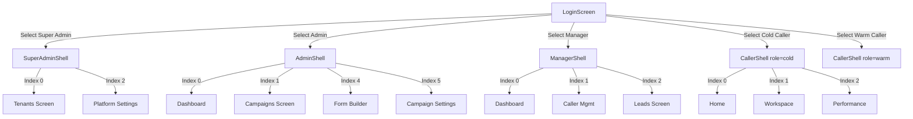
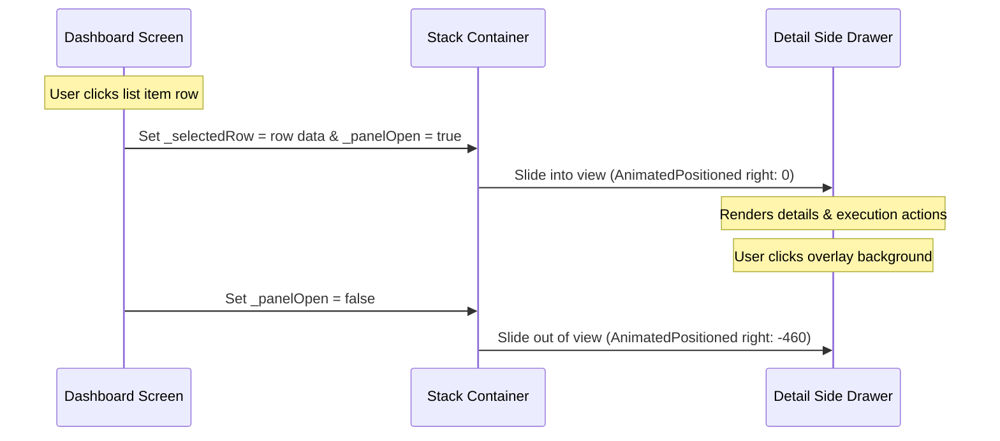

# CallingApp Architectural Documentation

Welcome to the CallingApp architecture guide. This document details the software architecture, user roles, navigation flow, design system, directory layout, and developer integration guidelines for the CallingApp platform.

---

## 1. Project Overview

CallingApp is a multi-tenant outbound call-center management platform built with Flutter. It supports high-velocity outbound campaign operations by integrating client data management, custom campaign form builders, agent execution workspaces, real-time queues, and manager supervision dashboards.

```
┌────────────────────────────────────────────────────────────────────────┐
│                              CallingApp                                │
├────────────────────────────────────────────────────────────────────────┤
│                                                                        │
│  ┌───────────────────────┐ ┌───────────────────┐ ┌──────────────────┐  │
│  │      Super Admin      │ │   Company Admin   │ │     Supervisor   │  │
│  │  Global Tenant Mgmt   │ │   Campaign/Users  │ │  Queue & Callers │  │
│  └───────────────────────┘ └───────────────────┘ └──────────────────┘  │
│                                                                        │
│               ┌─────────────────────┐ ┌─────────────────────┐          │
│               │     Cold Caller     │ │     Warm Caller     │          │
│               │   Fresh Outbound    │ │  Callback Followup  │          │
│               └─────────────────────┘ └─────────────────────┘          │
│                                                                        │
└────────────────────────────────────────────────────────────────────────┘
```

The system is designed with a responsive approach:
- **Desktop Web Interface**: For admins, super admins, and managers.
- **Mobile Simulated Interface**: Centred layout constrained to 420px for cold/warm callers to run seamlessly in mobile browsers or standalone mobile apps.

---

## 2. Folder Structure

The repository follows a feature-first structure under `lib/`, grouping all logic, views, and components by feature module.

```
lib/
├── features/
│   ├── auth/
│   │   └── login_screen.dart               # Entry point with role-based routing buttons
│   ├── super_admin/
│   │   ├── super_admin_shell.dart          # Platform owner wrapper (Sidebar + IndexedStack)
│   │   ├── tenants_screen.dart             # Multi-tenant status & detail panels
│   │   └── platform_settings_screen.dart   # Global feature flags & system variables
│   ├── company_admin/
│   │   ├── admin_shell.dart                # Company administrator wrapper
│   │   ├── dashboard_screen.dart           # Campaign portfolio, KPIs, & health logs
│   │   ├── campaign_screen.dart            # Campaign builder & detail side drawer
│   │   ├── form_builder_screen.dart        # Drag-and-drop form canvas editor
│   │   ├── csv_upload_screen.dart          # CSV file validator & upload queue
│   │   ├── user_management_screen.dart     # Supervisor & caller provisioning panels
│   │   └── campaign_settings_screen.dart   # Custom dispositions & webhook integrations
│   ├── manager/
│   │   ├── manager_shell.dart              # Campaign supervisor wrapper
│   │   ├── dashboard_screen.dart           # Live caller tracker & queue health metrics
│   │   ├── caller_management_screen.dart   # Real-time caller logs & campaign reassignments
│   │   └── leads_screen.dart               # Lead audits & text search matching
│   └── cold_caller/
│       ├── caller_shell.dart               # Simulated mobile bottom-nav wrapper (maxWidth: 420px)
│       ├── home_screen.dart                # Welcome board, Shift status, & Next Lead trigger
│       ├── calling_workspace_screen.dart   # Active dialer session timer, forms, & scheduler
│       └── performance_screen.dart         # Operator telemetry & disposition breakdowns
├── shared/
│   └── widgets/
│       ├── kpi_card.dart                   # Standard card display for numeric metrics
│       ├── sidebar_nav.dart                # Left navigation bar for desktop dashboards
│       ├── status_badge.dart               # Colored pill badge for database status tags
│       └── alert_row.dart                  # Warning notifications with timestamps
└── main.dart                               # App configuration & Theme instantiation
```

---

## 3. Roles & Access Control

CallingApp enforces strict visual segregation of resources based on 5 functional user roles:

| Role | Primary Functions | Shell Entry Point | Layout Profile |
| :--- | :--- | :--- | :--- |
| **Super Admin** | Platform configuration, multi-tenant billing, feature flag toggles, global telemetry. | `SuperAdminShell` | Web Desktop |
| **Company Admin** | Campaign provisioning, supervisor/caller allocation, CSV data imports, form definition, API webhooks. | `AdminShell` | Web Desktop |
| **Manager** | Live operations tracking, operator status monitors, queue balancing, audited log search. | `ManagerShell` | Web Desktop |
| **Cold Caller** | Fresh outbound dialing, timed profile generation, cold disposition tagging. | `CallerShell` (role: 'cold') | Simulated Mobile |
| **Warm Caller** | Scheduled callback queue execution, follow-up scheduler logging. | `CallerShell` (role: 'warm') | Simulated Mobile |

---

## 4. Navigation Architecture

Navigation is governed by a role-specific shell pattern using `IndexedStack` to maintain persistent visual states without page rebuilds.

```
                     ┌───────────────┐
                     │  LoginScreen  │
                     └───────┬───────┘
                             │ (pushReplacement)
       ┌─────────────────────┼─────────────────────┐
       ▼                     ▼                     ▼
┌──────────────┐      ┌──────────────┐      ┌──────────────┐
│SuperAdmin    │      │AdminShell    │      │ManagerShell  │
│Shell         │      │              │      │              │
│ ├─ Tenants   │      │ ├─ Dashboard │      │ ├─ Dashboard │
│ ├─ Users     │      │ ├─ Campaigns │      │ ├─ Callers   │
│ ├─ Platform  │      │ ├─ Users     │      │ ├─ Leads     │
│ └─ Billing   │      │ ├─ CSV       │      │ └─ Settings  │
└──────────────┘      │ ├─ FormBld   │      └──────────────┘
                      │ ├─ Dispos    │
                      └──────────────┘
```

### 4.1 Shell Components
1. **`SuperAdminShell`**: Uses left navigation sidebar layout. Switches between multi-tenant panels, global configuration settings, and billing logs.
2. **`AdminShell`**: Provides sidebar hooks to toggle between dashboards, campaign panels, provision tables, CSV uploads, custom forms, and API webhooks.
3. **`ManagerShell`**: Controls operations views containing caller tables, queue progress indexes, and lead databases.
4. **`CallerShell`**: Renders as a bottom navigation bar holding Home, Workspace, and Performance tabs.

### 4.2 Programmatic Navigation
Inter-module navigation (e.g., jumping from the Campaign list screen to the Form Builder or Campaign Settings screen) is handled programmatically using `GlobalKey` references to each parent shell state, bypassing typical route stacks:

```dart
// E.g., navigating to the Form Builder from Campaign list
AdminShell.shellKey.currentState?.navigateTo(4); // Switches to Form Builder tab
```

### 4.3 Side Panel Overlays
Detailed records, create/edit interfaces, and log history panels slide into the workspace horizontally instead of pushing a new view route:
- Controlled via boolean triggers (e.g., `_panelOpen`).
- Visualized using an `AnimatedPositioned` widget inside a parent `Stack`.
- Clicking outside of the panel (on a dim gesture detector background) closes the panel automatically.

---

## 5. Screen Index

The codebase defines several functional views categorized by role shell index mappings:

### 5.1 Authentication Screen
* **[login_screen.dart](file:///d:/Programs/Callingapp/lib/features/auth/login_screen.dart)**: Standard login input form with developer shortcut buttons at the bottom. These shortcuts permit instant routing to the different shell views for rapid prototyping.

### 5.2 Super Admin Module
* **[tenants_screen.dart](file:///d:/Programs/Callingapp/lib/features/super_admin/tenants_screen.dart)** (Index 0): Shows high-level statistics (Total, Active, Trial, Suspended), a tenant table, actions to suspend/activate tenants, and a side detail panel with a "Login as Admin" shortcut.
* **[platform_settings_screen.dart](file:///d:/Programs/Callingapp/lib/features/super_admin/platform_settings_screen.dart)** (Index 2): Contains Starter/Pro plan config, system feature flags, aggregated telemetry data, a global maintenance banner editor, and a protected danger zone (Reset Demo Data, Force Logout).

### 5.3 Company Admin Module
* **[dashboard_screen.dart](file:///d:/Programs/Callingapp/lib/features/company_admin/dashboard_screen.dart)** (Index 0): Aggregates global tenant statistics, lists campaigns in a status grid, shows supervisor performances, and alerts the administrator to queue issues.
* **[campaign_screen.dart](file:///d:/Programs/Callingapp/lib/features/company_admin/campaign_screen.dart)** (Index 1): Campaigns search directory with custom status filters, campaign metrics, a slide-out edit drawer, and configuration routing buttons.
* **[user_management_screen.dart](file:///d:/Programs/Callingapp/lib/features/company_admin/user_management_screen.dart)** (Index 2): Provisioning layout tracking manager and caller seat capacities, accompanied by inline quick-edit panels.
* **[csv_upload_screen.dart](file:///d:/Programs/Callingapp/lib/features/company_admin/csv_upload_screen.dart)** (Index 3): Interactive file drop target area with real-time feedback gauges showing clean vs. duplicate vs. invalid rows, a CSV rows preview grid, and an upload execution history log.
* **[form_builder_screen.dart](file:///d:/Programs/Callingapp/lib/features/company_admin/form_builder_screen.dart)** (Index 4): A field picker sidebar (Text, Number, Dropdown, Radio) with a central preview canvas and custom dropdown option setup triggers.
* **[campaign_settings_screen.dart](file:///d:/Programs/Callingapp/lib/features/company_admin/campaign_settings_screen.dart)** (Index 5): Contains campaign-specific configurations:
  - **Dispositions**: Custom outcome tags with switches to enforce caller notes or schedule follow-up callbacks.
  - **Retry Logic**: Configurable parameters for Max Retries, Retry After duration, and Daily Call Limits.
  - **CRM Webhook**: Target URL, payload triggers, and cryptographically masked secret key bindings.

### 5.4 Supervisor / Manager Module
* **[dashboard_screen.dart](file:///d:/Programs/Callingapp/lib/features/manager/dashboard_screen.dart)** (Index 0): Active caller status grid, pending queue length telemetry (Raw vs. Warm), and real-time alerts.
* **[caller_management_screen.dart](file:///d:/Programs/Callingapp/lib/features/manager/caller_management_screen.dart)** (Index 1): Operational caller stats, caller activity tables, and detail panels to reassign campaigns or view call histories.
* **[leads_screen.dart](file:///d:/Programs/Callingapp/lib/features/manager/leads_screen.dart)** (Index 2): Segregated view splitting audited leads (filtered by campaign and disposition) from instant query search fields. Clicking a lead slides out a detailed call profile, historical contact history log, and caller notes.

### 5.5 Caller Workspace (Cold/Warm)
* **[home_screen.dart](file:///d:/Programs/Callingapp/lib/features/cold_caller/home_screen.dart)** (Index 0): Shows daily call performance telemetry, shift duration tracks, and the primary "Get Next Lead" request button.
* **[calling_workspace_screen.dart](file:///d:/Programs/Callingapp/lib/features/cold_caller/calling_workspace_screen.dart)** (Index 1): Focus area displaying timer, customer information, call dialer controls, dynamic campaign forms (dropdown/text), notes field, disposition selector, callback scheduler, and a bottom submit action bar.
* **[performance_screen.dart](file:///d:/Programs/Callingapp/lib/features/cold_caller/performance_screen.dart)** (Index 2): Shift timeline summaries, caller conversion KPI grids, outcome bar graphs, and recent call histories.

---

## 6. Shared Widget Library

CallingApp maintains standard shared components located in `lib/shared/widgets/` to ensure visual parity:

### 6.1 `KpiCard`
* **File Path**: [kpi_card.dart](file:///d:/Programs/Callingapp/lib/shared/widgets/kpi_card.dart)
* **Description**: Renders a card displaying a numeric value, category label, and background-tinted icon container.
* **Parameters**:
  - `title`: Label text.
  - `value`: Main stat display value.
  - `icon`: Icon data representation.
  - `iconColor`: Primary color of the icon.
  - `iconBgColor`: Highlight color of the icon container.

### 6.2 `SidebarNav`
* **File Path**: [sidebar_nav.dart](file:///d:/Programs/Callingapp/lib/shared/widgets/sidebar_nav.dart)
* **Description**: Renders the persistent left-hand navigation sidebar used in the Company Admin shell.
* **Parameters**:
  - `selectedIndex`: Active menu item tracking integer.
  - `onItemSelected`: Callback fired on navigation select events.

### 6.3 `StatusBadge`
* **File Path**: [status_badge.dart](file:///d:/Programs/Callingapp/lib/shared/widgets/status_badge.dart)
* **Description**: Renders a compact pill badge with custom text. Its background color automatically applies 12% opacity to match the foreground theme color.
* **Parameters**:
  - `label`: Display text inside badge.
  - `color`: Highlight foreground styling color.

### 6.4 `AlertRow`
* **File Path**: [alert_row.dart](file:///d:/Programs/Callingapp/lib/shared/widgets/alert_row.dart)
* **Description**: Notification row component displaying warning indicators, messages, and elapsed time logs.
* **Parameters**:
  - `message`: Description text string.
  - `timeAgo`: Elapsed time metadata.

---

## 7. Design System

The layout architecture employs a clear design system built on custom styling palettes:

### 7.1 Palette Specifications
```dart
const kPrimaryBlue = Color(0xFF1A73E8); // Main branding color (Google Blue)
const kGreen       = Color(0xFF34A853); // Successful outcomes, active statuses
const kRed         = Color(0xFFEA4335); // Critical errors, DNC tags, delete actions
const kOrange      = Color(0xFFFA7B17); // Intermediate flags, warning states, retry alerts
const kPurple      = Color(0xFF9334E9); // Special indicators (e.g. Warm queue)
const kGrey        = Color(0xFF80868B); // Secondary text labels & placeholders
const kTextPrimary = Color(0xFF202124); // Primary text body color
const kTextLight   = Color(0xFF5F6368); // Secondary text label color
const kBorder      = Color(0xFFE8EAED); // Table dividers & container edges
const kBgPage      = Color(0xFFF8F9FA); // Standard canvas background tone
```

### 7.2 Typography & Theme
- **Global Font**: Google Fonts Inter text styles (`GoogleFonts.interTextTheme()`).
- **Icons**: Standard Material Icons library.
- **Card Shadow**: Standardized elevated borders (`BoxShadow(color: Color(0x14000000), blurRadius: 6, offset: Offset(0, 2))`).

### 7.3 Simulated Mobile Layout
For mobile views (`cold_caller/` module), simulated layout conditions center the widget tree:
```dart
Scaffold(
  backgroundColor: Color(0xFFF0F0F0), // Grey outer desktop background
  body: Center(
    child: ConstrainedBox(
      constraints: BoxConstraints(maxWidth: 420), // Lock to typical mobile aspect width
      child: Container(
        color: Colors.white, // Active application background
        child: Column(
          children: [ ... ],
        ),
      ),
    ),
  ),
);
```

---

## 8. Navigation Flow Diagrams

The following flow diagrams illustrate the interaction states between the app's components:

### 8.1 Authentication Redirection Flow


### 8.2 Inner Shell Overlay Drawer Pattern


---

## 9. Shared State & Global Keys

To facilitate cross-screen workflow routing without maintaining deep page navigation history, CallingApp employs static global keys across shell components.

### 9.1 Global Key Definition
Each shell exposes a static `GlobalKey` referencing its state:
```dart
class AdminShell extends StatefulWidget {
  const AdminShell({super.key});

  static final GlobalKey<AdminShellState> shellKey = GlobalKey<AdminShellState>();

  @override
  State<AdminShell> createState() => AdminShellState();
}
```

### 9.2 Programmatic Navigation Execution
Any child page can navigate to a specific tab index by calling the global key:
```dart
void editCampaignForm(String campaignId) {
  // Navigate directly to the Form Builder (index 4)
  AdminShell.shellKey.currentState?.navigateTo(4);
}
```
This pattern allows the application to:
- Preserve widget configuration state inside non-active stack layers.
- Avoid passing deep callback routines across screens.
- Keep the sidebar navigation highlighted at the correct menu selection index.

---

## 10. FlutterFlow Migration Notes

When refactoring codebase items generated by or migrated from FlutterFlow, developers should apply these optimization guidelines to maintain a clean codebase:

### 10.1 Segregate Layout from Business Logic
* **Problem**: FlutterFlow often bundles API queries and business logic inline inside layout classes.
* **Resolution**: Keep screens strictly focused on layout representation. Move business calculations, list operations, validation rules, and network requests into separate service controllers (e.g., `lib/features/company_admin/campaign_service.dart`).

### 10.2 Replace Inline Styling with Theme Definitions
* **Problem**: Auto-generated views often feature absolute sizes, colors, and margins declared inline.
* **Resolution**: Replace inline values with standard widgets (such as `StatusBadge`) and retrieve styles from the centralized theme system (using `Theme.of(context)`). Maintain semantic separation of background and text highlights.

### 10.3 Restructure Widget Layout Hierarchies
* **Problem**: Migrated screens may contain redundant wrappers (such as nested Rows, Columns, and Containers).
* **Resolution**: Flatten complex layouts, replace nested alignment wraps with unified grid constraints where possible, and reuse standard widgets (like `KpiCard` or `AlertRow`).

---

## 11. Future Backend Integration Points

The codebase uses mock data schemas matching the target endpoints of the backend API. Below are the core integration points for connection:

```
                               ┌───────────────┐
                               │  CallingApp   │
                               └───────┬───────┘
                                       │ (HTTPS / WebSockets)
       ┌───────────────────────────────┼───────────────────────────────┐
       ▼                               ▼                               ▼
┌──────────────┐                ┌──────────────┐                ┌──────────────┐
│  CRM System  │                │ Dialer Queue │                │ DNC Registry │
│ Webhook Sync │                │ WebSocket    │                │ Cache Check  │
└──────────────┘                └──────────────┘                └──────────────┘
```

### 11.1 Webhook & CRM Synchronisation
- **Target Interface**: Campaign Settings panel.
- **Backend Model**: Webhook payload listener triggering on specific events (e.g., `On Interested`, `On Form Submit`).
- **Payload Schema**:
  ```json
  {
    "event": "disposition_logged",
    "campaign_id": "c1029",
    "lead_id": "l98432",
    "disposition": "Interested",
    "caller_id": "u4392",
    "form_data": {
      "full_name": "Rajesh Kumar",
      "city": "Mumbai",
      "monthly_income": "45000",
      "interest_level": "High"
    },
    "notes": "Interested in premium package, follow up scheduled.",
    "timestamp": 1780744700000
  }
  ```

### 11.2 CSV Processing Pipeline
- **Target Interface**: CSV Upload screen.
- **Backend Model**: Multiparts file upload endpoints accepting tabular records, running validation matches, filtering duplicates, and appending fresh entries to the campaign repository.

### 11.3 Real-Time WebSocket Dialer Queues
- **Target Interface**: Caller Workspace.
- **Backend Model**: Active WebSocket channels assigning next available leads based on rules (such as max attempts and campaign priorities), and registering caller statuses in real-time.

### 11.4 DNC Check Integrations
- **Target Interface**: Dialer dial system.
- **Backend Model**: Immediate check query against the DNC registry database before processing a call dial event in the workspace.
